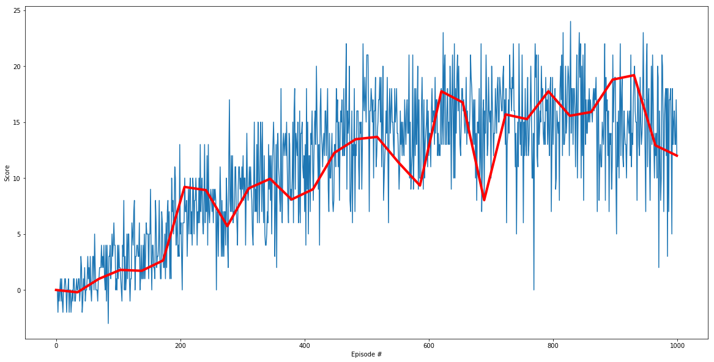

# Project 1: Navigation
## Udacity Deep Reinforcement Learning

The purpose of this document is to describe the details of the project; including the algorithm, network architecture, training hyperparameters and results. 

*This project is based on the course work and repository for [Deep Q-Network (DQN)](https://github.com/udacity/deep-reinforcement-learning/tree/master/dqn)* 

--- 
## Project overview 
The objective of this project was to train an agent to navigate (and collect bananas!) in a large, square world.

A reward of +1 is provided for collecting a yellow banana, and a reward of -1 is provided for collecting a blue banana. Thus, the goal of your agent is to collect as many yellow bananas as possible while avoiding blue bananas.

The state space has **37 dimensions** and contains the agent's velocity, along with ray-based perception of objects around the agent's forward direction. Given this information, the agent has to learn how to best select actions. **Four discrete actions** are available, corresponding to:

- **`0`** - move forward.
- **`1`** - move backward.
- **`2`** - turn left.
- **`3`** - turn right.

## Algorithm and Architecture 
This project uses Deep Q-Network to teach an agent to navigate the world.
Q-Learning is a common technique for learning a *policy* to make decisions on what *action* to take given the current *state* of the environment; this policy is typically encoded in a *Q-Table*. In Deep Q-network the *Q-Table* is replaced with a *Deep Neural Nerwork*.
In addition, the Deep Q-network also adds the following to make learning more stable: 
### Experience Reply 
When the agent interacts with the environment, the sequence of experience tuples can be highly correlated. The naive Q-learning algorithm that learns from each of these experience tuples in sequential order runs the risk of getting swayed by the effects of this correlation. By instead keeping track of a replay buffer and using experience replay to sample from the buffer at random, we can prevent action values from oscillating or diverging catastrophically.

The replay buffer contains a collection of experience tuples (S, A, R, S') 

## Fixed Q-Targets 
To mitigate the effects of Carrot Stick Riding which Q-learning is prone to as in the basic algorithm with updates guess with a guess, we use fixed Q-targets. Q-network uses two networks the *local Q-network* and *target Q-network* (both identical in architecture). The *target Q-network* is updated only occasionally  by the *local Q-network* to mitigate this issue. 

The network architecture consisted of two *Fully Connected Layers* followed by *ReLU* activations and then finally feed through a *Fully Connected Layer* for a linear output.  

## Training 
The process and algorithm of training is explained above; therefore here we will focus on presenting the training hyper-parameters.  

### Hyperparameters 
- BUFFER_SIZE - 100000). 
- BATCH_SIZE - 64
- Discount Factor GAMMA - 0.99 
- TAU - 1e-3 
- UPDATE_EVERY - 4
- n_episodes - 10000. 
- max_t - 1000

The plot below shows the average score (taking over a window of size 10) during training. 

## Future Improvements

* Train on pure pixels as suggested in the optional task.
* Try more advanced networks like Double DQN, Dueling DQN, Rainbow etc. which were taught in class. A challenge is getting hold of a GPU environment to train on these.
